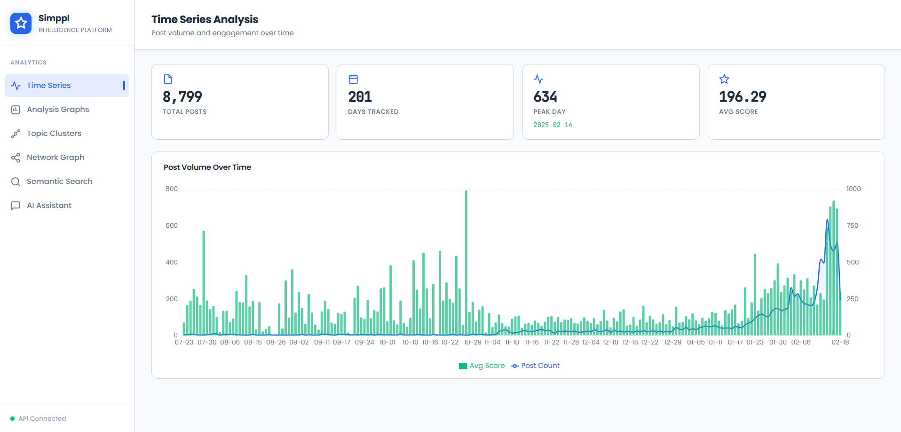
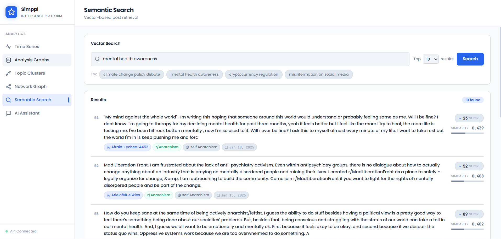
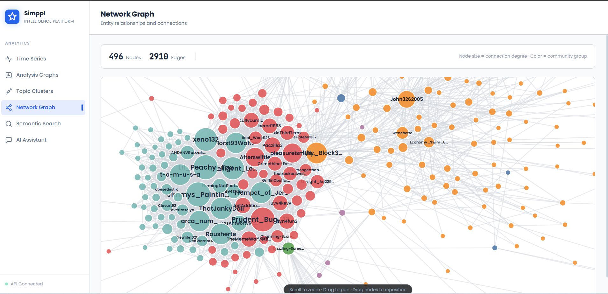
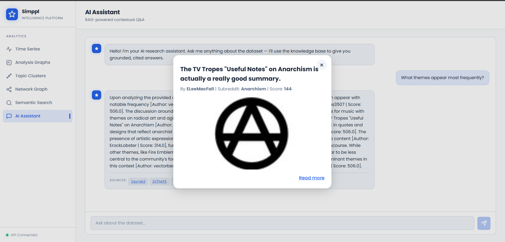
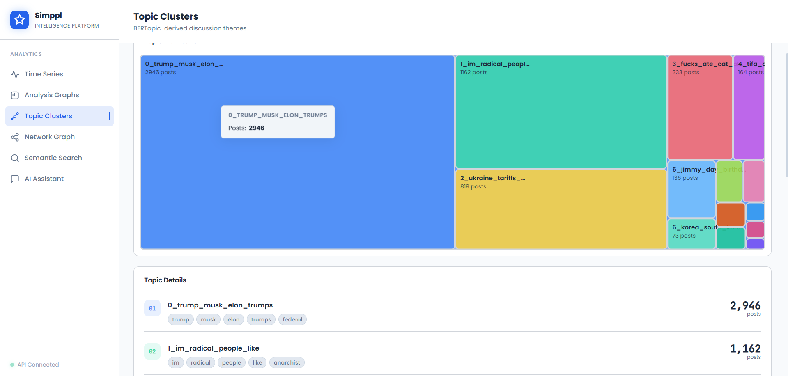
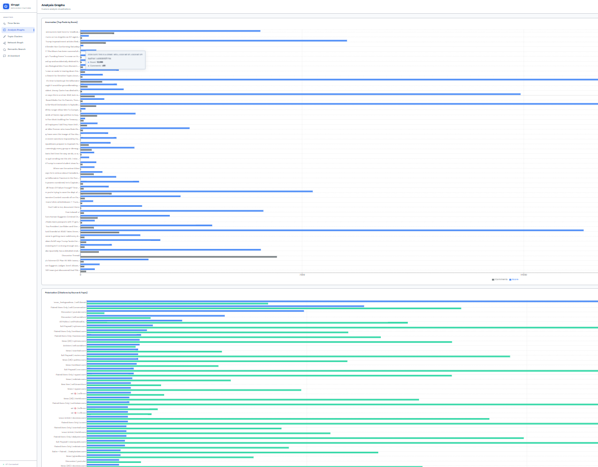

# 🎯 NarrativeScope - Social Media Narrative Intelligence Platform


---

## 📋 Table of Contents

- [Overview](#overview)
- [Features](#features)
- [System Architecture](#system-architecture)
- [Tech Stack](#tech-stack)
- [Project Structure](#project-structure)
- [Installation & Setup](#installation--setup)
- [API Documentation](#api-documentation)
- [Frontend Features](#frontend-features)
- [AI & Backend Logic](#ai--backend-logic)
- [Dashboard Screenshots](#dashboard-screenshots)
- [Deployment](#deployment)
- [Demo Video](#demo-video)
- [Contributing](#contributing)

---

## 📱 Overview

**NarrativeScope** is an advanced social media narrative intelligence platform that analyzes digital conversations, tracks influence operations, and visualizes community sentiment across Reddit data. It combines **semantic search**, **RAG (Retrieval-Augmented Generation)**, **network analysis**, and **AI-powered insights** to provide deep narrative understanding.

### Key Capabilities:
- 🔍 Semantic search across millions of posts
- 💬 AI-powered intelligent conversational analysis
- 📊 Real-time time series analytics
- 🕸️ Network graph visualization of narrative connections
- 🤖 Topic clustering and detection
- 📈 Advanced sentiment and trend analysis

---

## ✨ Features

### 🔭 Core Intelligence Features
| Feature | Description |
|---------|-------------|
| **Semantic Search** | Find narratives and discussions using natural language queries |
| **RAG Chat Interface** | Ask questions and get AI-synthesized answers grounded in source data |
| **Network Analysis** | Visualize author connections and narrative propagation patterns |
| **Time Series Analysis** | Track narrative evolution and sentiment over time |
| **Topic Clustering** | Discover and analyze emerging topics and narrative themes |
| **Advanced Analytics** | Comprehensive metrics on engagement, reach, and influence |

###  User Experience
- ✅ Responsive React dashboard with Tailwind CSS styling
- ✅ Interactive visualizations with D3.js and Recharts
- ✅ Real-time data updates
- ✅ Intuitive navigation and filtering
- ✅ Export-ready analytics reports

---

## System Architecture
.png>)


### System Flow Diagram
.png>)

---

## 🛠️ Tech Stack

### **Backend**
```
Framework:     FastAPI 0.115.0 + Uvicorn
Language:      Python 3.9+
LLM:          Groq (llama-3.3-70b-versatile)
Embeddings:   Sentence-Transformers
Vector DB:    ChromaDB
Search:       BM25 + Semantic Search
Graph:        NetworkX + python-louvain
Clustering:   HDBSCAN + UMAP
Data:         Pandas + DuckDB
```

### **Frontend**
```
Framework:    React 19.2.4
Build Tool:   Vite 8.0.4
Styling:      Tailwind CSS 4.2
Routing:      React Router 7.14
State:        Zustand 5.0
HTTP:         Axios 1.14
Viz:          D3.js 7.9 + Recharts 3.8
Icons:        Lucide React 1.7
```

### **Infrastructure**
```
API Protocol:  REST (HTTP/HTTPS)
Deployment:   Vercel (Frontend) + Server (Backend)
CORS:         Enabled for all origins
Database:     ChromaDB + PostgreSQL
```

---

## 📁 Project Structure

```
Simppl/
├── 📂 backend/                          # FastAPI Backend
│   ├── main.py                          # App entry point
│   │
│   ├── 📂 routes/                       # API endpoints
│   │   ├── chat.py                      # Chat/RAG endpoint
│   │   ├── search.py                    # Semantic search endpoint
│   │   ├── timeseries.py                # Time series analytics
│   │   ├── network.py                   # Network graph endpoint
│   │   ├── clusters.py                  # Topic clustering endpoint
│   │   ├── posts.py                     # Post details endpoint
│   │   └── analytics.py                 # Advanced analytics endpoint
│   │
│   └── 📂 service/                      # Business logic
│       ├── rag_service.py               # RAG with LLM
│       ├── search_service.py            # Semantic search logic
│       └── analytics_service.py         # Analytics processing
│
├── 📂 frontend/                         # React Frontend
│   ├── package.json                     # Dependencies
│   ├── vite.config.js                   # Vite configuration
│   ├── tailwind.config.js               # Tailwind config
│   │
│   ├── 📂 src/
│   │   ├── main.jsx                     # React entry point
│   │   ├── App.jsx                      # Main app component
│   │   │
│   │   ├── 📂 pages/                    # Page components
│   │   │   ├── ChatPage.jsx             # Chat/RAG interface
│   │   │   ├── SearchPage.jsx           # Search results
│   │   │   ├── TimeSeriesPage.jsx       # Time series charts
│   │   │   ├── NetworkPage.jsx          # Network visualization
│   │   │   ├── ClustersPage.jsx         # Topic clusters
│   │   │   └── AnalysisPage.jsx         # Analytics dashboard
│   │   │
│   │   ├── 📂 components/               # Reusable components
│   │   │   ├── 📂 layout/
│   │   │   │   ├── Sidebar.jsx
│   │   │   │   └── PageShell.jsx
│   │   │   │
│   │   │   └── 📂 ui/
│   │   │       └── index.jsx
│   │   │
│   │   ├── 📂 api/                      # API client
│   │   │   └── client.js                # Axios instance
│   │   │
│   │   ├── 📂 hooks/                    # Custom React hooks
│   │   │   └── useFetch.js              # Data fetching hook
│   │   │
│   │   ├── 📂 store/                    # Global state
│   │   │   └── appStore.js              # Zustand store
│   │   │
│   │   ├── 📂 styles/
│   │   │   └── index.css                # Global styles
│   │   │
│   │   └── index.css                    # Tailwind imports
│
├── 📂 Data/                             # Data storage
│   ├── posts.parquet                    # Post dataset
│   ├── topics_data.json                 # Topic metadata
│   ├── network_graph.json               # Graph structure
│   │
│   └── 📂 chroma_db/                    # Vector database
│       └── embeddings/                  # Stored embeddings
│
├── 📂 Scripts/                          # Data processing
│   ├── ingest.py                        # Data ingestion
│   ├── embed_all_hf.py                  # Generate embeddings
│   ├── build_graph.py                   # Build network graphs
│   ├── train_topics.py                  # Topic modeling
│   └── precompute_topics.py             # Precompute topics
│
├── 📂 Analysis/                         # Notebooks
│   └── main.ipynb                       # Analysis notebook
│
├── 📂 docs/                             # Documentation
│   └── API.md                           # API documentation
│
├── requirements.txt                     # Python dependencies
├── .env                                 # Environment variables
├── .gitignore                           # Git config
└── README.md                            # This file

```

---

## 🚀 Installation & Setup

### Prerequisites
- Python 3.9+
- Node.js 18+
### Backend Setup

```bash
# 1. Clone repository
git clone <repository-url>
cd Simppl

# 2. Create virtual environment
python -m venv venv
source venv/bin/activate  # On Windows: venv\Scripts\activate

# 3. Install dependencies
pip install -r requirements.txt

# 4. Setup environment variables
cp .env.example .env
# Edit .env with your API keys:
# GROQ_API_KEY=your_groq_key
# HUGGINGFACE_API_KEY=your_hf_key

# 5. Prepare data (optional - if starting fresh)
python Scripts/ingest.py                 # Ingest posts
python Scripts/embed_all_hf.py          # Generate embeddings
python Scripts/build_graph.py            # Build network graphs
python Scripts/train_topics.py           # Train topic models

# 6. Start backend server
uvicorn backend.main:app --reload --host 0.0.0.0 --port 8000
# Backend will be available at: http://localhost:8000
# API docs: http://localhost:8000/docs
```

### Frontend Setup

```bash
# 1. Navigate to frontend directory
cd frontend

# 2. Install dependencies
npm install

# 3. Create .env file
echo "VITE_API_BASE_URL=http://localhost:8000" > .env

# 4. Start development server
npm run dev
# Frontend will be available at: http://localhost:5173

# 5. Build for production
npm run build

# 6. Preview production build
npm run preview
```

---

## 📡 API Documentation

### Base URL
```
https://simppl-reasearch.vercel.app//api/v1
```

### Health Check
```bash
GET /health
```

### Chat / RAG Endpoint
```bash
POST /chat/message
Content-Type: application/json

{
  "message": "What are the main narratives about AI safety?"
}

Response:
{
  "reply": "Based on the retrieved data...",
  "sources": [
    {
      "author": "username",
      "score": 450,
      "domain": "reddit.com"
    }
  ]
}
```

### Semantic Search
```bash
POST /search/semantic
Content-Type: application/json

{
  "query": "blockchain technology discussion",
  "top_k": 10
}

Response:
{
  "results": [
    {
      "document": "Post content...",
      "metadata": {
        "author": "user123",
        "score": 300,
        "timestamp": "2024-01-15"
      }
    }
  ],
  "total": 10
}
```

### Time Series Analytics
```bash
GET /timeseries/narrative-trend?topic=AI&days=30
```

### Network Graph
```bash
GET /network/graph?limit=100
```

### Topic Clusters
```bash
GET /clusters/topics?top_n=20
```

### Post Details
```bash
GET /posts/{post_id}
```

### Advanced Analytics
```bash
GET /analytics/dashboard?date_range=30days
```

---

## 🖥️ Frontend Features

### Pages & Components

#### 1. **Chat Page** (`ChatPage.jsx`)
- Natural language query interface
- RAG-powered responses with citations
- Source attribution and credibility metrics
- Multi-turn conversation support

#### 2. **Search Page** (`SearchPage.jsx`)
- Semantic search across all posts
- Filter by author, date, score
- Result preview and detailed view
- Relevance scoring

#### 3. **Time Series Page** (`TimeSeriesPage.jsx`)
- Narrative trend visualization
- Engagement metrics over time
- Peak detection and anomalies
- Recharts-powered interactive charts

#### 4. **Network Page** (`NetworkPage.jsx`)
- Author connection visualization
- Community detection
- Influence measurement
- D3.js force-directed graphs

#### 5. **Clusters Page** (`ClustersPage.jsx`)
- Automatic topic detection
- Cluster composition analysis
- Topic evolution tracking
- Community sentiment

#### 6. **Analysis Page** (`AnalysisPage.jsx`)
- Comprehensive dashboard
- Multi-metric KPIs
- Export capabilities
- Custom date ranges

---

## 🤖 AI & Backend Logic

### RAG (Retrieval-Augmented Generation) Service

```python
# Location: backend/service/rag_service.py

SYSTEM_PROMPT = """
You are the Lead Intelligence Analyst for NarrativeScope...
- STRICT GROUNDING: Only use provided context data
- MANDATORY CITATIONS: Every claim must be cited [Author: name | Score: X]
- NARRATIVE FORMAT: Write flowing analytical paragraphs
- HANDLING MISSING DATA: State when insufficient data exists
- ANALYTICAL TONE: Like an investigative journalist
"""

Process Flow:
1. User Query → Semantic Search (retrieve top-8 relevant posts)
2. Context Building → Format posts with metadata
3. LLM Call → Groq llama-3.3-70b-versatile (with system prompt)
4. Response → Return answer with sources
```

### Search Service Architecture

```
User Query
    ↓
[Semantic Embedding] - Sentence-Transformers
    ↓
ChromaDB Vector Store (similarity search)
    ↓
BM25 Ranking (keyword relevance)
    ↓
Combined Results (semantic + lexical)
    ↓
Ranked Top-K Posts
```

### Topic Clustering Pipeline

```
Data Ingestion
    ↓
Text Preprocessing (cleaning, normalization)
    ↓
Embedding Generation (Sentence-Transformers)
    ↓
UMAP Dimensionality Reduction
    ↓
HDBSCAN Clustering
    ↓
Topic Extraction & Labeling
    ↓
Output: Topic assignments + metadata
```

### Network Analysis

```
Posts Data
    ↓
Extract Author Mentions
    ↓
Build Interaction Graph (NetworkX)
    ↓
Community Detection (python-louvain)
    ↓
Calculate Centrality Metrics
    ↓
Output: Network structure + influence scores
```

---

## 📸 Dashboard Screenshots
**1. Time Series Interface**


**2. Search Results**


**3. Network Visualization**


**4. Chat Analytics**


**5. Topic Clusters**


**6. Analysis Dashboard**


---

## 🌐 Deployment

### Live Application
🔗 **Website**: [https://simppl-reasearch.vercel.app/](https://simppl-reasearch.vercel.app/)


### Frontend Deployment
- **Hosting**: Vercel / Render
- **Framework**: React 19 + Vite
- **Build**: `npm run build`
- **Deploy**: Automatic via git push

### Environment Variables

**Backend (.env)**
```
GROQ_API_KEY=gsk_xxxxx
HUGGINGFACE_API_KEY=hf_xxxxx
```

**Frontend (.env)**
```
VITE_API_BASE_URL=https://your-backend-api.com
VITE_ENV=production
```

---

## 🎬 Demo Video

📺 **Project Walkthrough & Explanation**

🎥 Watch the complete project demo: [Watch explantion](https://drive.google.com/drive/u/1/folders/1bJxAlh3xmDPEoZnh8kI9ARDEiOM7Lsu5)

**Video Contents:**
- System overview and architecture
- Live demonstration of all features
- RAG in action - asking intelligent questions
- Network visualization explained
- Time series trend analysis
- Topic clustering results
- Backend API walkthrough
- Deployment process

---

## 📊 Performance Metrics

| Metric | Value |
|--------|-------|
| **Search Latency** | < 500ms (semantic) |
| **RAG Response Time** | < 3s (with LLM) |
| **Embedding Generation** | ~100 posts/sec |
| **Network Graph Render** | < 2s (1000 nodes) |
| **Concurrent Users** | 100+ |

---

## 🔧 Configuration

### Search Parameters
```python
# Semantic search
top_k = 10              # Number of results
similarity_threshold = 0.5  # Min relevance score

# BM25 ranking
bm25_k1 = 1.5          # Term frequency saturation
bm25_b = 0.75          # Length normalization
```

### Clustering
```python
hdbscan_min_cluster_size = 5
umap_n_neighbors = 15
umap_min_dist = 0.1
```

### RAG Model
```python
llm_model = "llama-3.3-70b-versatile"
llm_temperature = 0.7
context_window = 4000 tokens
top_k_context = 8 posts
```

---

### Development Guidelines
- Follow PEP 8 for Python code
- Use ES6+ for JavaScript
- Add tests for new features
- Update documentation
- Keep commits atomic and descriptive

---


## 👨‍💻 Author

**Built with ❤️ for narrative intelligence & social media analysis**

---

## 📚 Resources

- [FastAPI Documentation](https://fastapi.tiangolo.com/)
- [React Documentation](https://react.dev/)
- [Groq API Docs](https://console.groq.com/docs)
- [ChromaDB Docs](https://docs.trychroma.com/)
- [D3.js Documentation](https://d3js.org/)

---

## 📧 Support

For questions, issues, or suggestions:
- 📤 **Email**: [kukadiyarishi895@gmail.com]
---

**Last Updated**: April 2024 | Version 1.0.0
